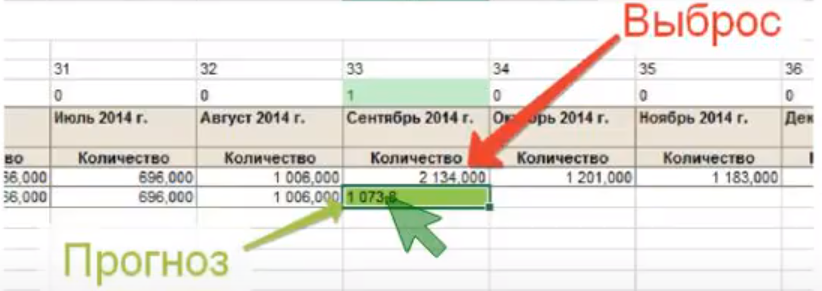

# Любой прогноз всегда ошибочен. Весь вопрос в том, насколько он ошибочен.

# Прогнозирование Спроса. 
## Постановка задачи.

### Организация прогнозирования.
До того, как процесс будет автоматизирован **Необходимо**: 
- процесс описать - регламентировать, 
- описание модели прогнозирования и связанных бизнес-процессов,
- факторы - логика применений и бизнес-процесс по каждому фактору,
- согласовать регламент со всеми участниками,  
- выстроить процесс,  
- ***АВТОМАТИЗИРОВАТЬ***.

> В этом процессе строго соблюдать как минимум два правила:  
    - Использование определенной модели должно быть однозначно объяснимо с точки зрения здравого смысла. Мы можем попробовать ввести в модель продаж холодильников в Бобруйске в качестве фактора погоду в Гондурасе. И, не исключено, получим модель с меньшей ошибкой. Но до тех пор, пока мы не можем сформулировать, какова может быть причинно-следственная связь между этими явлениями, такой фактор вводить нельзя.  
    - Работа по улучшению качества прогноза (улучшению модели) стоит вполне ощутимых денег. Поэтому всегда необходимо отдавать себе отчет в том, что начиная с какого-то момента эти усилия попросту перестают окупаться. Как и в некоторых других случаях, лучше вовремя остановиться.

**Простота модели**
> Чем проще модель, тем лучше она будет воспринята менеджерами фирмы, ответственными за принятие решения, и тем выше будет их доверие к полученному прогнозу. Часто следует отдавать предпочтение не более сложному подходу к прогнозированию, предлагающему немного больше точности, а более простому, понятному руководителям компании. Когда выбранный метод получает поддержку у менеджеров, то и результаты прогнозирования активно ими используются.

### Процесс прогнозирования.
***Цикл***: 

---
1) *Подготовка данных к прогнозу (регулярный процесс)*.
> При анализе большого массива данных необходимы **индикаторы**, которые будут подсказывать, на какие позиции обратить внимание в первую очередь для проверки данных.

> Добавлять ли данные и на каком этапе о "курсах валют" или "погоды" с привязкой к временным рядам, в сырые данные, дабы улучшить будующую модель? Ответ на данный вопрос можно получить из процесса прогнозирования(описаного ниже).  

***! атуально добавлять некоторые данные - внешние факторы, в сырые данные, после формирования модели прогнозирования на основании внутренних факторов***

___
- **Индикатор №1**. ***Коэффициент вариации***. (подходит для выделения событий за последний период).  
    Расчет коэффициента осуществляется по формуле:
    $CV = (\sigma / k) * 100$

    $\sigma$ - среднеквадратическое отклонение случайной величины.  
    $k$ - ожидаемое (среднее) значение случайной величины.
    
    В статистике принято, что:
    если коэффициент вариации меньше 10%, то степень рассеивания данных считается незначительной;
    если от 10% до 20% - средней;
    больше 20% и меньше или равно 33% - значительной.
    Если значение коэффициента вариации не превышает 33%, то совокупность считается однородной, а если больше 33%, то – неоднородной.

    Одно из важных применений коэффициента вариации - оценка инвестиционных рисков. Действительно, чем выше вариативность доходности некоторого инвестиционного инструмента, тем выше связанные с ним риски. Коэффициент вариации является относительной мерой риска на единицу доходности, поэтому позволяет сопоставлять риск и доходность двух и более активов, которые могут существенно отличаться.

    Другими словами, коэффициент вариации увязывает среднеквадратическое отклонение с ожидаемой доходностью актива, что дает возможность оценить соотношение «риск/доходность» в относительном выражении и позволяет обеспечить сопоставимость полученных результатов.
    
    Минимизировать коэф-т вариации с помощью:  
    - **группировки**,  
    - **уплотнения**(сворачивание данных(отдельные товары в товарные группы ...)),  
    - **очистки дефицита**,  
    - **подмены**,  
    - **восстановления**,  
    - **очистки факторов**  
    
*Пример*:  
        сделать из массива выборку за последние 4 месяца и проанализировать вариативность последних 4-х месяцев. Если значение коэффициента вариации больше 30%, то стоит изучить конкретный временной ряд и определить **факторы**, повлиявшие на отклонение.  
    

    
___
- **Индикатор №2**. ***Диаграмма размаха ("ящик с усами")***. (подходит для поиска, внутри конкретного временного ряда, момента времени в котором произошел выброс. Также подходит для поиска факторов создающих выбросы во временных рядах). 

**Виды наблюдений**, которые можно сделать на основе ящика с усами:  
- Каковы ключевые значения, например: средний показатель, медиана 25го перцентиля и так далее.  
- Существуют ли выбросы и каковы их значения.  
- Симметричны ли данные.  
- Насколько плотно сгруппированы данные.  
- Смещены ли данные и, если да, то в каком направлении.  

> Выбросы - это части данных, что попали либо выше первого квартиля либо ниже 4-го квартиля на полтора межквартильных размаха. Другими словами, выбросы - такая часть данных, что не попадает в границы доверительных интервалов.

> Доверительный интервал определяется от медианы(всей выборки временного ряда, отсортированного от min к max).  

С помощью доверительного интервала мы можем:  
    - Выделить направления, на которые стоит обратить внимание, т.к. в этих направлениях произошли события, которые могут повлиять на изменение тенденции.  
    - Определить факторы, которые реально влияют на изменение ситуации.  
    - Принять взвешенное решение (например, о закупках, при планировании и т.д.).  

> Межквартильный размах - разница между верхней и нижней квартилью.

___
- **Индикатор №3**. ***Анализ корреляции***. (Определение оптимального набора данных для прогноза).

    > Обработчик на основании вычисляемых коэффициентов корреляции выявляет взаимосвязь между рядами данных входного набора. Применяется для оценки предполагаемой зависимости факторов.

    Позволяет определить, процент влияния определенных факторов на процесс в целом.  

    **Например**: Определить влияние акций на продаваемость групп товаров.

___
- **Индикатор №4**. ***Многомерная регрессия***. (Полезна поскольку отдельные одномерные модели игнорируют корреляции).
    > Суть регрессионного анализа: построение математической модели и определение ее статистической надежности.
    Вид множественной линейной модели регрессионного анализа: $Y = b0 + b1xi1 + ... + bjxij + ... + bkxik + ei$  
    *где $e_i$ - случайные ошибки наблюдения, независимые между собой, имеют нулевую среднюю и дисперсию $s$.*
        
    **Назначение множественной регрессии**: анализ связи между несколькими независимыми переменными и зависимой переменной. Cмысл параметров множественной регрессии, в том
    что коэффициент множественной регрессии $b_j$ показывает, на какую величину в среднем изменится результативный признак $Y$, если переменную $X_j$ увеличить на единицу измерения, т. е. является нормативным коэффициентом.

    **Действия**
    1.) Выделяются события в отдельные столбцы (Пример: Берется выборка типа: Временной ряд + Акция).
    2.) 1 - есть событие. 0 - нет события.
    3.) Оценивается влияние событий.
    4.) Очищаем данные от событий.
    5.) Строим прогноз на восстановленных данных.
    6.) Корректируется прогноз событиями.

---
- Сбор данных (продажи, факторы, события которые повлияли на результат продаж).

---
- Учет факторов (анализ факторов и событий, что повлияли на прогноз).  
    По каждому фактору описывается механизм его приминения:  
    Внутренние факторы:
    - Прирост объема продаж.  
    - Объем продаж.  
    - Прогноз объема продаж.  
    
    Внешний фактор:  
    - Корректировка коэффициентом регрессии - многофакторная модель.

---
- Создание групп прогнозирования (анализ продаж по продуктовой матрице, выбор групп прогнозирования).

---
- Очистка данных от выбросов - аномальных значений.

**Популярное**

*Один из самых интересных методов* сглаживания - восстановления данных (исправления места во временном ряде где зафиксированы выбросы), это взять для анализа временной ряд до того как случился выброс и составить прогноз для того самого участка где выброс был зафиксирован, тем самым заменив новым значением место выброса.

*Второй способ* - это восстановление очень короткого промежутка (неполного месяца в полный). 

**Пример**:  
Было 30 продаж одного товара, за 16 дней из 31. Соответственно 30/16х31 ~= 58 продаж ожидается.

*Третий способ* - Отказ от части данных. Если выбранный временной ряд не коррелирует с другими.

**Пример**:  
2016 год не коррелирует с 2018 - то просто отказываемся от него, без попыток восстановления, потому что, скорее всего в последнее время были внесены координальные перемены в процесс ведения деятельности и этот процесс стал сильно отличаться от выбранного временного ряда.

---
2) Выбор модели и расчет прогноза.  

    Анализ временных рядов.
    
___
    Подбор модели.

___
    Тестирование модели.

___
    Расчет прогноза.

---
3) Корректировка прогноза факторами. 

> **ВАЖНО** Каждый фактор - это маленькая модель прогнозирования и от точности прогноза по каждому фактору зависит в целом итоговая точность прогноза по компании.

> Прогноз + доп.факторы. По каждому фактору описывается логика его применения к прогнозу.
    

---

4) Оценка точности прогноза.  
> Так как инструментов анализа много, то все зависит от того, в какой момент времени этапа прогноза какой инструмент использовать.

## Процесс прогнозирования.

- Например можно использовать факторы на этапе "сырых данных", потом к "подготовленным данным" применить другие факторы.
- Определить группы прогнозирования (собрать статистику в группы).
- Подобрать модель прогнозирования.
- Рассчитать прогноз.
- На основании ошибки, которая осталась от прогноза, определить влияние внешних факторов на эту ошибку. Применить внешние факторы к прогнозу.
- Расчитать прогноз с учетом внешних факторов и распределить это все на позиции ниже(анализируемые в группах позиции).
- Скорректировать прогноз внутренними факторами.

## Подготовка формул  прогнозной модели.
### Наивные методы прогнозирования.
#### ***Простое среднее***   

>В простом случае, когда измеренные значения колеблются вокруг некоторого уровня, очевидным является оценка среднего значения и предположение о том, что и впредь реальные продажи будут колебаться вокруг этого значения.

$`Y(t)=C+\varepsilon(t)`$

$`C = \frac{1}{N}\sum\limits_{1}^N X`$

#### ***Скользящее среднее***

>Одной из модификаций модели среднего, учитывающей это явление, является отбрасывание наиболее старых данных и использование для вычисления среднего лишь нескольких k последних точек.

$C = \frac{1}{N}\sum\limits_{N-k}^N X$

#### ***Взвешенное скользящее среднее***

> Следующим шагом в модификации модели является предположение о том, что более поздние значения ряда более адекватно отражают ситуацию. Тогда каждому значению присваивается вес, тем больший, чем более свежее значение добавляется.

$C=\frac{\sum\limits_{N-k}^N a_iX_i}{\sum\limits_{N-k}^N a_i}$

> Для удобства можно сразу выбрать коэффициенты таким образом, чтобы сумма их составляла единицу, тогда не придется делить. Будем говорить, что такие коэффициенты отнормированы на единицу.